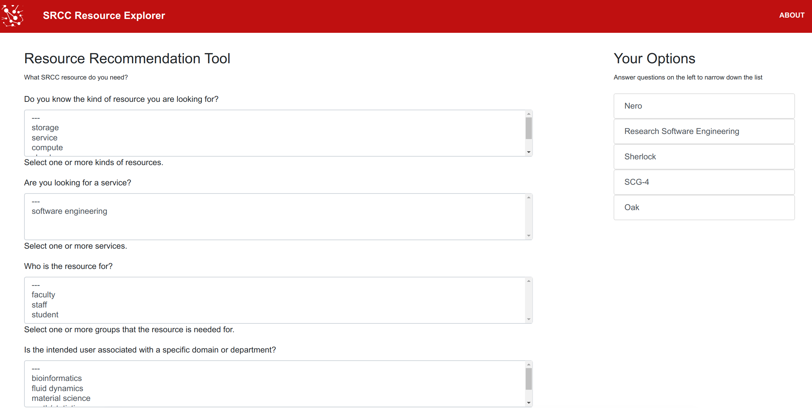

# Resource Explorer



This is a resource explorer for interactive selection of a storage, compute, service,
or other resource provided by Research Computing. The idea comes by way
of the griznoggiest wisdom of @griznog.

## Resources and Questions

The [resource-explorer.js](resource-explorer.js) starts with variables for questions
and resources that drive the logic of the interface. The user will be presented
with a series of easy to answer questions, and the selection of resources
will be narrowed down based on the answers. Specifically:

### Questions

Include multiple-choice, single-choice, boolean, and enumerate-choice.

 - **multiple-choice** means that the user can select zero through N choices. For example, I might want to select that a resource is for staff, faculty, and students.
 - **single-choice**: is a choice question where the user is only allowed to select one answer. If you need to implement a boolean, use a single-choice with two options.
 - **minimum-choice**: indicates a single choice field where the choices have integer values, and the user is selecting a minimum. For example, if the user selects a minimum storage or memory size, all choices above that will remain.
 - **maximum-choice**: is equivalent to minimum-choice, but opposite in direction. We select a maximum.

In the above, an enumerate choice implies there is an ordering to the logic. The user might want a minimum or maximum
amount of memory, for example. Each question should be under the questions variable (a list), and have a title, description, required (true or false) and then options. For example:

```json
      {
         "title": "Who is the resource for?",
         "id": "q-who",
         "description": "Select one or more groups that the resource is needed for.",
         "required": false,
         "type": "multiple-choice",
         "options": [
            {
               "name": "faculty",
               "id": "who-faculty"
            },
            {
               "name": "staff",
               "id": "who-staff"
            },
            {
               "name": "student",
               "id": "who-student"
            }
         ]
      }
```

For a minimum-* or maximum-* choice, the ids must end in an integer value:

```json
      {
         "title": "What size of storage are you looking for?",
         "id": "q-size",
         "description": "If applicable, give an approximate unit of storage.",
         "required": false,
         "type": "minimum-choice",
         "options": [
            {
               "name": "gigabytes",
               "id": "size-gigabytes-1"
            },
            {
               "name": "terabytes",
               "id": "size-terabytes-2"
            },
            {
               "name": "petabytes",
               "id": "size-petabytes-3"
            }
         ]
      },
```

We do this so we can parse the ids and then rank order them. For a boolean choice, you can just use a single-choice
with two choices:

```json
      {
         "title": "Do you require backup?",
         "id": "q-backups",
         "description": "Some or all of your files will be copied on a regular basis in case you need restore.",
         "required": false,
         "type": "single-choice",
         "options": [
            {
               "name": "backups",
               "id": "backups-true"
            },
            {
               "name": "no backups",
               "id": "backups-false"
            }
         ]
      },
```

Notice that each choice has a unique id associated with it. These will be used as tags associated with each
resource to help with the filtering.

### Resources

A typical resource looks like this:

```json
      {
         "title": "Nero",
         "id": "nero",
         "url": "https://nero-docs.stanford.edu",
         "attributes": {
           "q-kind": ["kind-compute", "kind-cloud"],
           "q-service": [],
           "q-who": ["who-faculty"], // only faculty allowed
                                     // domain is left out, implying all domains
                                     // size is left out, implying all sizes
           "q-framework": ["framework-kubernetes", "framework-containers"],
           "q-backups": ["backups-true"]
         }
      },
```

Note that we require a title (a user friendly print-able value), an id (for the object in the DOM), a url to
link to, and then a list of attributes. For each attribute, the key corresponds to an id for a question,
and then the list of values is a list of responses that, if chosen by the user, would make 
it a valid choice. Specifically:
  
 - if a question key is defined but empty, a selection of any field for the key invalidates the resource.
 - if a question key is not defined, making a choice for any field for doesn't impact the resource (it stays or remains hidden).
 - if a question key includes a subset of choices, then the resource is kept only if the user chooses a selection in the list.

For the above, this would mean that:

 - if the user selected any kind of `q-service`, the Nero option would be hidden.
 - if the user selected kind-compute and/or kind-cloud, Nero would remain.
 - if the user selected any other kind of audience other than faculty (who-faculty) Nero would be hidden.
 - Selecting framework as kubernetnes or containers will keep Nero. Selecting slurm (not in the list) will hide it.
 - Selecting backups-false will hide Nero.

This repository serves only as an example, and doesn't reflect the actual state of Stanford resources (but we will make one!)
